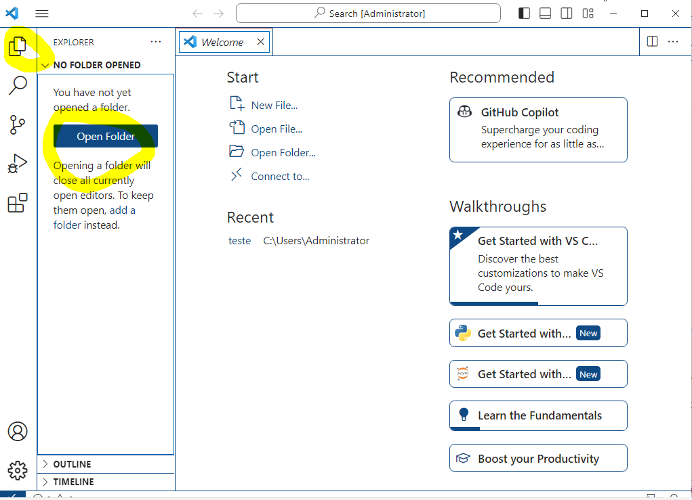
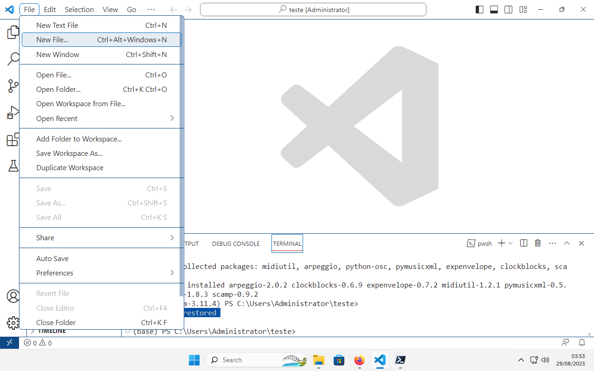
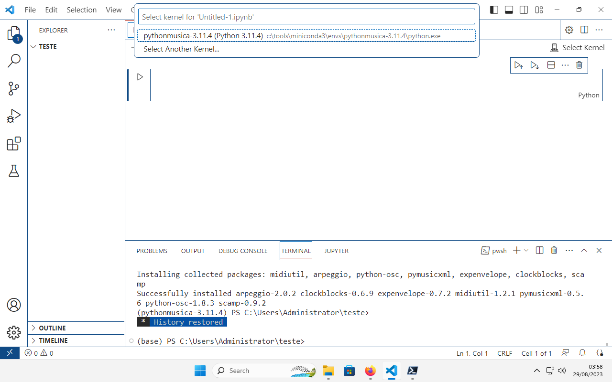
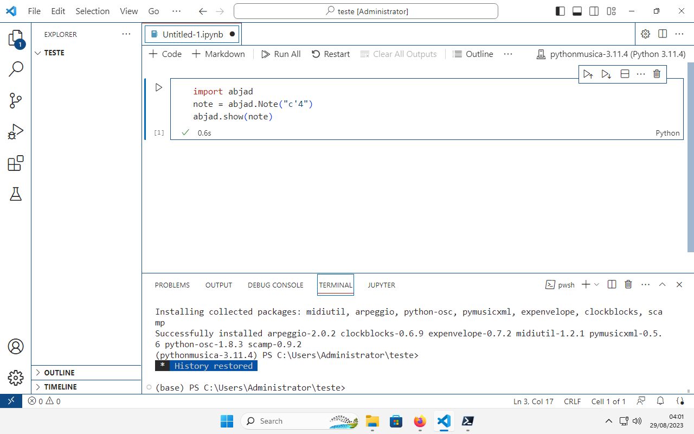
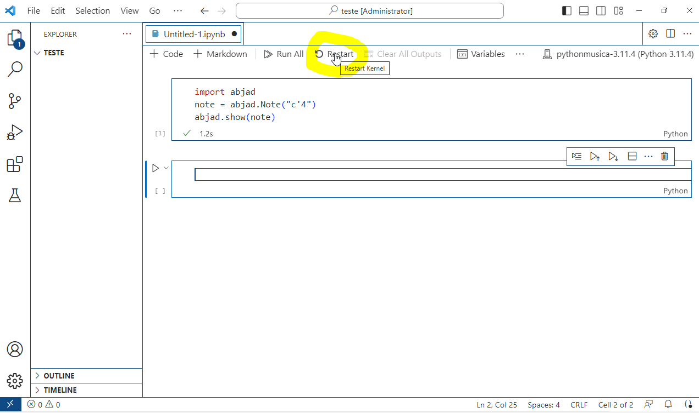
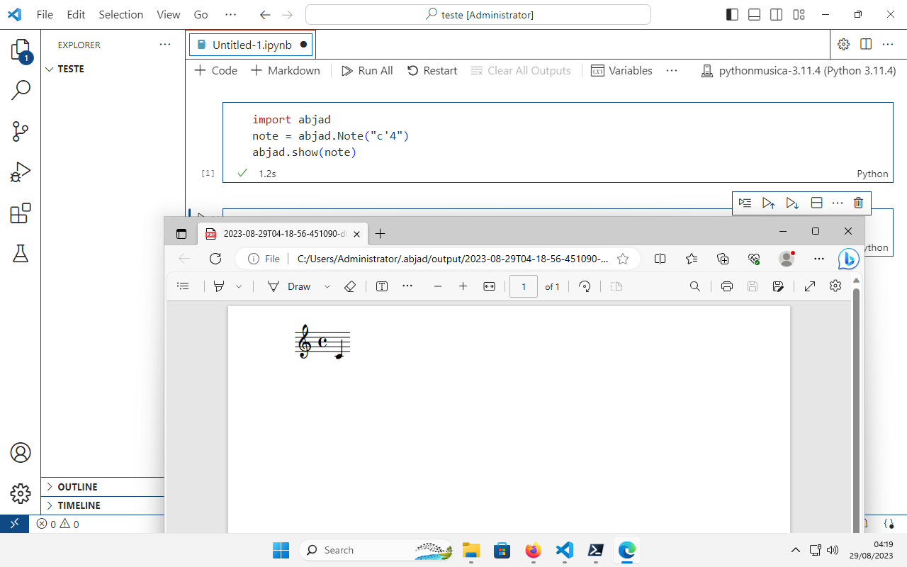
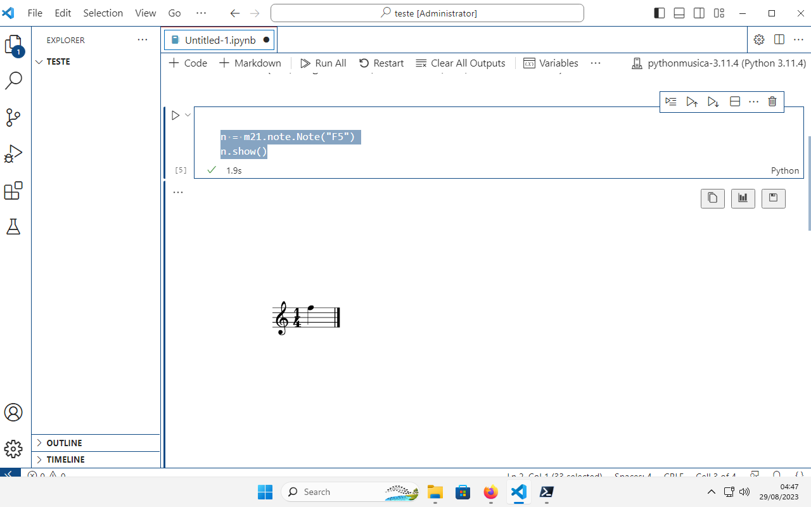

## Setup inicial no Windows

### 1. [opcional] Gerenciador de pacotes do Windows: **chocolatey**

É recomendado instalar um gerenciador de pacotes no seu sistema operacional. Embora estejamos habituados a instalar aplicativos utilizando ícones e aplicativos, utilizar um gerenciador pela linha de comando facilita gerenciar aplicativos e ferramentas que serão utilizadas ao longo das aulas. Em síntese, um gerenciador de pacotes permite instalar e atualizar aplicativos pela linha de comando, gerenciando de maneira mais prática/rápida sua versão, instalação e desinstalação.

No Windows, recomendamos o gerenciador **chocolatey**:

Para um guia em vídeo sobre como instalar o *chocolatey*, ver:

[](https://www.youtube.com/watch?v=eHoh_ptUkmw)

1. Instalar *chocolatey* a partir do site: [https://chocolatey.org/install]

    2.1 Abrir PowerShell em modo admnistrador

    2.2 Executar o comando `Get-ExecutionPolicy`. Se retornar: `Restricted`, execute o comando `Set-ExecutionPolicy RemoteSigned `

    2.3 Executar o script de instalação do *chocolatey*:

    ```
    Set-ExecutionPolicy Bypass -Scope Process -Force; [System.Net.ServicePointManager]::SecurityProtocol = [System.Net.ServicePointManager]::SecurityProtocol -bor 3072; iex ((New-Object System.Net.WebClient).DownloadString('https://community.chocolatey.org/install.ps1'))
    ```

### 2. Instalação da versão mais recente do PowerShell

Recomenda-se instalar o PowerShell 7. Via chocolatey, execute o comando abaixo (ou procure manualmente, via buscador de sua preferência, por PowerShell 7 e instale via ícone):

    ```
    choco install powershell-core -y
    ```

### 3. Instalação do Python a partir do miniconda

Para um guia em vídeo sobre como instalar o *miniconda* e o *Python* no windows, ver:

[](https://www.youtube.com/watch?v=qt9UGKVSXnY)

1. Instalar o **miniconda** pelo PowerShell (em modo admnistrador):

    ```
    choco install miniconda3
    ```

    Caso não tenha instalado o chocolatey, será necessário baixar o instalador manual do miniconda e rodar o executável manualmente.

2. Feche o shell que estiver usando e, no menu do windows, procure por 'Anaconda PowerShell Prompt' e, clicando com o botão direito, **rode como admnistrador**:
   
   No terminal, execute as duas linhas (em alguns sistemas uma funcionou, em outros a segunda opção é que foi efetiva):

    ```
    conda init powershell
    conda init
    ```

    obs: feche o shell (sempre em modo admnitrador) para que isso faça efeito

3. Execute o PowerShell 7 como administrador (botão direito, **Run as admnistrator**/**Executar como admnistrador**)

4. Criar um *ambiente*/*environment* Python utilizando o conda:

    ```
    conda create -n <nome_do_ambiente> python=<versão_do_python>
    ```

    **exemplo**:

    ```
    conda create -n pythonmusica-3.11.4 python=3.11.4
    ```

4. Ativar o ambiente criado:

    ```
    conda activate pythonmusica-3.11.4
    ```

5. Intalação do Jupyter

    ```
    pip install jupyter
    ```

6. Configurar o kernel Jupyter (que possibilita utilizarmos o ambiente criado em modo interativo):

    ```
    python -m ipykernel install --user --name pythonmusica-3.11.4 --display-name "pythonmusica-3.11.4"
    ```

7. Testando/rodando o Jpyter:

    ```
    jupyter notebook
    ```

8. Instalação de pacotes (exemplo com `numpy`. `abjad` 3.18 e `music21`):

    ```
    pip install numpy abjad==3.18 music21
    ```

### 4. Instalação e configuração do Visual Studio

Para um guia em vídeo sobre como instalar e configurar o Visual Studio, ver (ignore a parte do vídeo sobre o Atom, editor que foi descontinuado):

[](https://www.youtube.com/watch?v=YxqoFTBYQLE)

1. Abrir PowerShell em modo admnistrador

2. Instalação do Visual Studio Code:

    ```
    choco install vscode -y
    ```

3. Configuração Visual Studio:

      Instalar pacotes/extensões:
      - `Python`
      - `Jupyter`
      - `ipython`

### 5. Instalação do Musescore e do LilyPond

(OBS: Caso não tenha instalado o chocolatey, será necessário baixar o instalador manual do Musescore e do Lilypond e rodar os instaladores manualmente.)

1. Instalação do Musescore:
    
    ```
    choco install musescore -y
    ```

2. Instalação do LilyPond:

    ```
    choco install lilypond -y
    ```


### 6. Adicione o lilypond e o musescore às variáveis de ambiente do sistema

1. Pela barra de buscas, pelo menu do windows ou pelo painel de controle, procure por Sistema/Sobre (System/About)

2. Procure pelo link `Advanced system settings` / `Configurações avançadas de sistema`:
   
   

3. Clique no botão `Environment variables` / `Variáveis de ambiente`

    
   
4. Selecione a linha `Path` nas variáveis do seu usuário e clique em `Edit` / `Editar`
   
   

5. Clique em novo para adicionar um novo caminho

    

6. Busque pelo diretório onde ficam os binários do LilyPond, usualmente em `C:\Program Files(x86)\LilyPond\usr\bin`

    

7. Repita o processo e busque pelo diretório onde ficam os binários do Musescore, usualmente em `C:\Program Files\MuseScore 4\bin`


### 7. Abjad - configuração e teste

**IMPORTANTE** Antes de tudo, tenha certeza que você já instalou o `Abjad` no seu ambiente (ver passo 3.8, acima!)

1. Abra o Visual Studio Code e abra/crie uma pasta de trabalha na aba lateral:



2. Em `Arquivo`/`Novo Arquivo` ( `File/New File`), crie um novo arquivo do tipo Jupyter Notebook:



3. Selecione o kernel / ambiente em que você está trabalhando. No nosso exemplo, aquele chamado `pythonmusica-3.11.4`:



4. Vamos rodar um pequeno código que gera uma partitura, com o `Abjad`+`LilyPond`. Isso também servirá para inicializar o arquivo de configuração do `Abjad`, que precisaremos ajustar para a configuração do computador em que estamos trabalhando:



5. Após rodar esse comando, vamos procurar por um arquivo de configuração criado pelo `Abjad`. Esse arquivo fica em uma pasta oculta localizada na pasta do seu usuário no Windows. Para facilitar o processo de editar esse arquivo, usaremos o PowerShell:

    5.1 Abra o Powershell e digite as linhas abaixo:

    ```
    cd
    code .\.abjad\abjad.cfg
    ```
    
    OBS: se o VS te perguntar se confia no autor da pasta, diga que sim.

    5.2 Na linha iniciada em `lilypond_path`, substitua a parte à direita do sinal `=` pelo caminho completo do executável do LilyPond (em algumas máquinas as bibliotecas que vamos usar -- especialmente o `SCAMP` só funcionam assim)
    
    ```
    lilypond_path = "C:\Program Files (x86)\LilyPond\usr\bin\lilypond.exe"
    ```
    
    5.3 Nesse arquivo você também poderá configurar outros aplicativos padrão utilizados pelo `Abjad` para tocar arquivos midi, visualizar pdfs, etc. Também é possível especificar em qual pasta os pdfs de teste (não salvos diretamente em alguma pasta específica) serão salvos. Não vamos configurar isso agora, mas é importante que você saiba para que serve esse arquivo e seja capaz de ajustá-lo quando precisar.

6. Voltando à pasta de trabalho do `Abjad`, reinicie o kernel....
   


7.   ...e execute novamente o bloco de teste do `Abjad`. Deve aparecer um pdf, no seu leitor padrão de pdfs, com a partitura gerada:



### 8. SCAMP - configuração e teste

1. No VS Code, abra o terminal utilizando o menu (`View/Terminal` ou `Visualizar/Terminal`) ou usando o atalho `Ctrl+'` 

2. Mude para o *environment* que está trabalhando usando o código abaixo, no nosso exemplo `pythonmusica-3.11.4`

   ```
   conda activate pythonmusica-3.11.4
   ```

3. Instale o SCAMP (é recomendado fazer isso apenas após a etapa de teste/configuração do `Abjad`, que fizemos anteriormente):

   ```
   pip install scamp
   ```

4. De volta ao seu notebook, na parte superior da tela, rode o seguinte bloco de código em uma nova célula:

   ```
   from scamp import test_run
   test_run.play(show_lilypond=True)
   ```

   Se tudo der certo, você ouvirá as notas de piano e, quando terminado o áudio, será gerada a partitura, que você visualizará no seu leitor padrão de pdf.


### 9. music21 - instalação e teste

**IMPORTANTE** Antes de tudo, tenha certeza que você já instalou o `music21` no seu ambiente (ver passo 3.8, acima!)

1. Primeiramente vamos configurar `music21` para encontrar o `MuseScore 4`, que ele utilizará para gerar partituras em formato xml.
   
   Rode, em uma nova célula do seu notebook, o comando abaixo:

```
import music21 as m21

m21set = m21.environment.UserSettings()
m21set['musicxmlPath'] = 'C:\\Program Files\\MuseScore 4\\bin\\MuseScore4.exe'
m21set['musescoreDirectPNGPath'] = 'C:\\Program Files\\MuseScore 4\\bin\\MuseScore4.exe'
m21set['musicxmlPath']
```

2. Em seguida, vamos testar gerando, novamente, apenas uma nota (deve aparecer, no próprio notebook, a imagem de uma partitura):
   
```
n = m21.note.Note("F5")
n.show()
```



